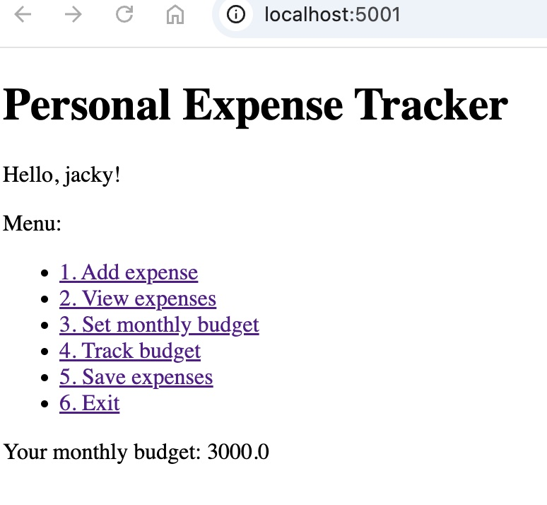
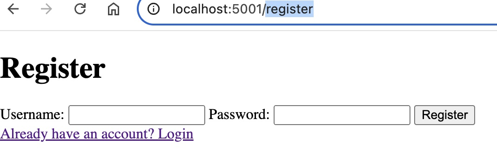
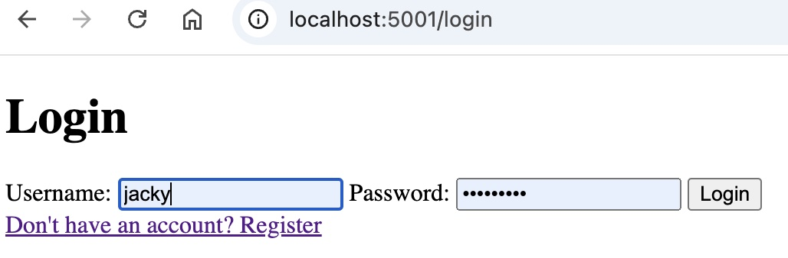
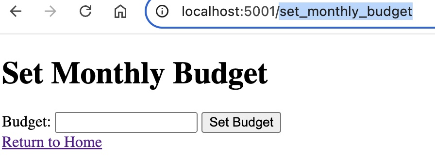
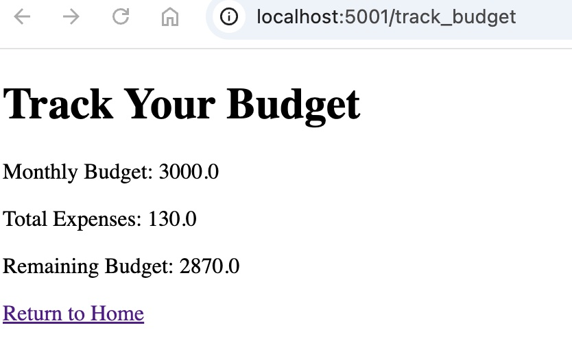
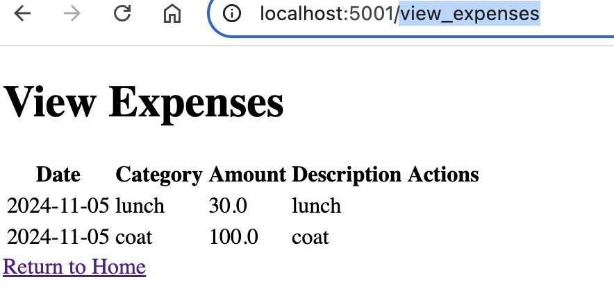

# Expense Tracker Application

This is an expense tracking application built with Flask.
This is an expense tracking application built with Flask.

## Screenshots
### Home Page

### Rigister page

### Login page

### Set Monthly Budget page

### Track Budget page

### view expenses page

## Installation
1. Run the `setup_expense_tracker.sh` script. This script will perform the following actions:
    - Handle any necessary self-extraction processes.
    - Clean up any previous installations.
    - Copy existing user data and expense data if any.
    - Move the extracted files to the correct location.
    Example: `./setup_expense_tracker.sh`
2. Build the Docker image using the following command: `./manage.sh [build|rebuild].`
3. Start the container with the `start` command: `./manage.sh start`

## Usage
You can access the application at `http://localhost:5001`.

## Mounting Volumes
The Docker container mounts the `/app/data` directory for CSV files and the `/app/log` directory for logs.

## Routes
- `/`: Home page. Displays interactive menu options.
- `/register`: Registration page.
- `/login`: Login page.
- `/logout`: Logout functionality.
- `/add_expense`: Route for adding an expense.
- `/view_expenses`: Route for viewing all expenses.
- `/set_monthly_budget`: Route for setting the monthly budget.
- `/save_expenses`: Route for saving expenses.
- `/track_budget`: Route for tracking the budget.
- `/edit_expense/<expense_id>`: Route for editing an expense by its ID.
- `/delete_expense/<expense_id>`: Route for deleting an expense by its ID.

## Manage.sh Arguments
- `build`: Build the Docker container and handle self-extraction.
- `debug`: Start the Docker container in debug mode.
- `start`: Start the Docker container.
- `stop`: Stop the Docker container.
- `status`: Check the status of the Docker container.
- `clean`: Clean Docker images.
- `restart`: Restart the Docker container.
- `rebuild`: Rebuild the Docker container.

## Contributors
Shouwei Lin

## License
This project is licensed under the MIT License.
